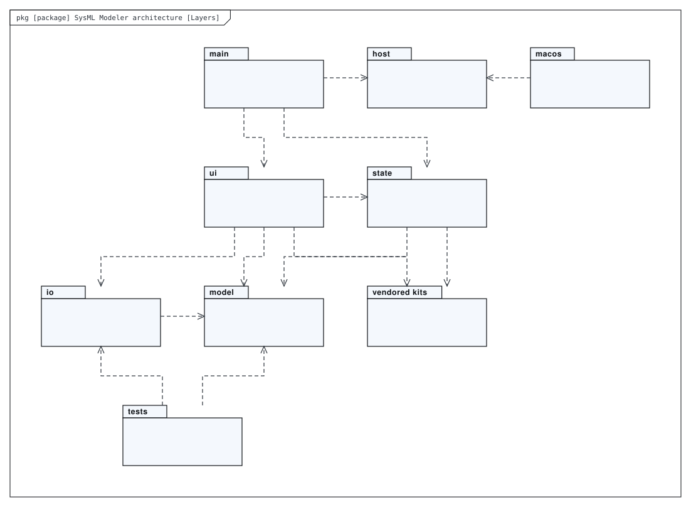
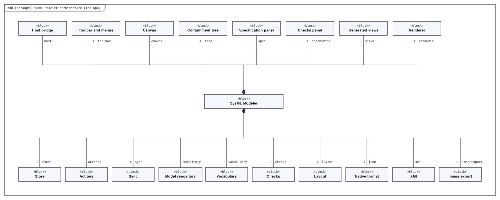
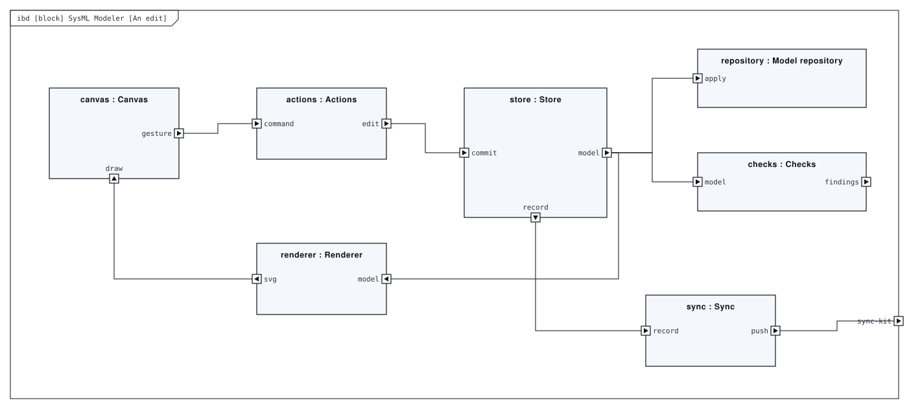
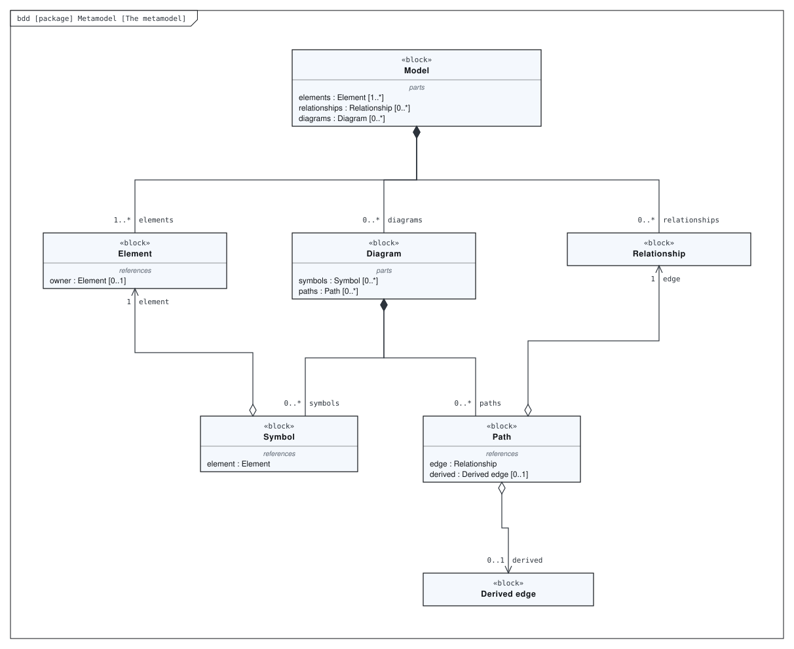
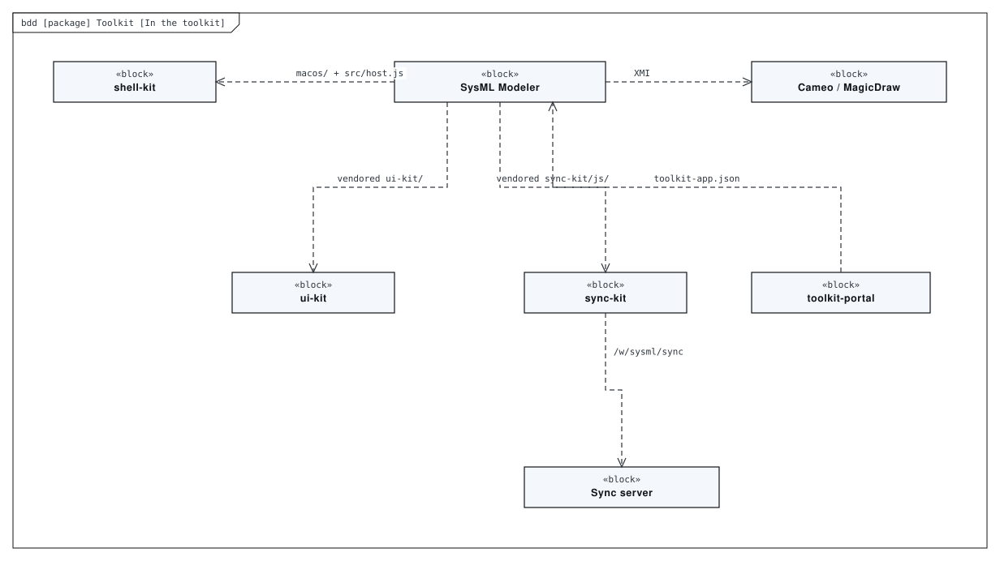
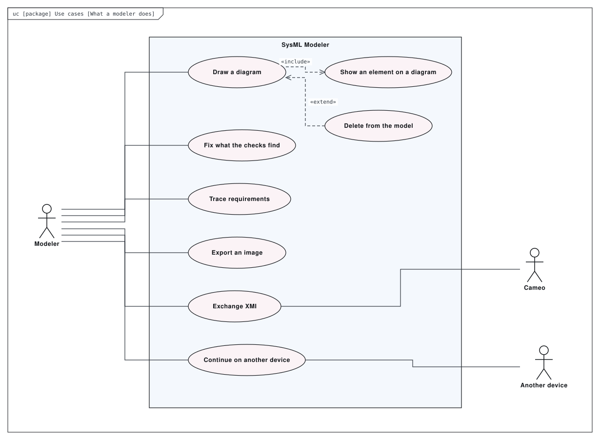
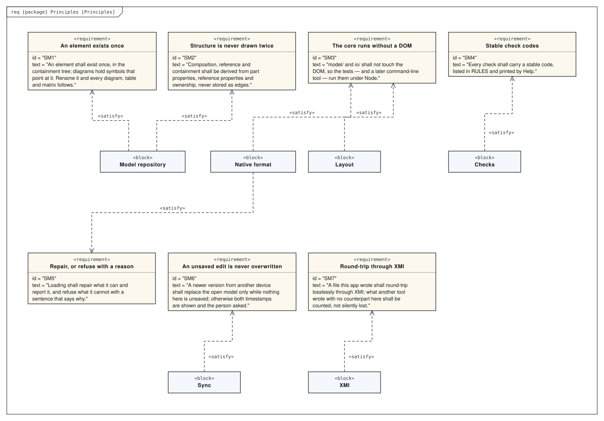

# Architecture

A browser-based SysML modeling tool in the manner of Cameo Systems Modeler, and the tool that drew this model of itself. One model repository, many diagrams over it; a specification panel, live checks, generated tables and matrices, XMI interchange, and export to SVG / PNG / PDF. No build step and no dependencies: `model/` and `io/` never touch the DOM, `state/` owns edits and undo, `ui/` draws. A macOS app hosts the same page on shell-kit, and the Portal serves it at `/sysml/`.

This directory holds a SysML model of the repository, made with [SysML Modeler](https://github.com/allenxhsu/sysml-modeler).
`architecture.sysml.json` is the source: open it with **File ▸ Open** in the modeler to edit it, and re-export the SVGs from there.
The SVGs below are exports of it. The model passes the modeler's checks with 0 errors and 0 warnings.

## Layers

*Package diagram* of **SysML Modeler architecture**.

## The app

*Block definition diagram* of **SysML Modeler architecture**.

## An edit

*Internal block diagram* of **SysML Modeler**. No build step, no package manager, no dependencies — plain ES modules and SVG, styled with ui-kit.

## The metamodel

*Block definition diagram* of **Metamodel**. What the app edits: the shape of a *.sysml.json model.

## In the toolkit

*Block definition diagram* of **Toolkit**. The repositories on the other side of this app’s interfaces.

## What a modeler does

*Use case diagram* of **Use cases**.

## Principles

*Requirement diagram* of **Principles**. The rules the README builds the app on.

## Generated views

Computed from the model each time it is opened in the modeler:

- **Principles, as a table** — requirement table
- **What verifies which principle** — dependency matrix
